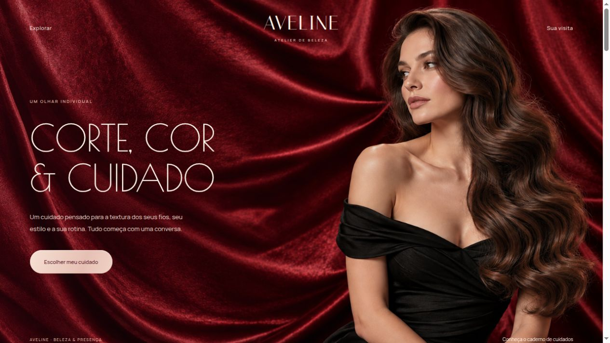
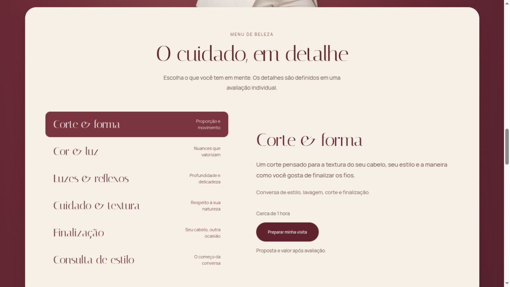
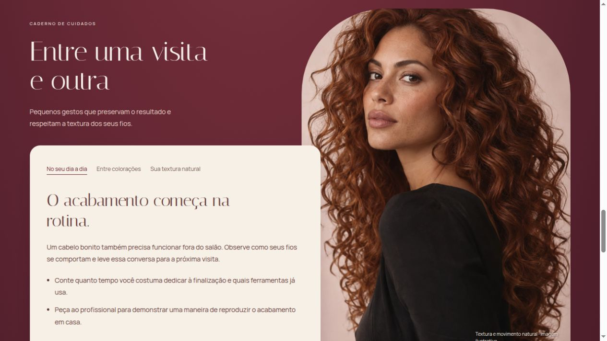

<div align="center">

# AVELINE
### Atelier de beleza

Uma experiência de beleza com direção editorial, tons de vinho e marfim e atenção a cada interação.

**Vue 3 · Vite · CSS · Lenis**

[Conheça o site](https://clever-starburst-2a2467.netlify.app/) · [Explore o código](src/App.vue)

</div>



## O projeto

Aveline é um salão de beleza conceitual criado por **Giselly Pereira**. A fotografia, a tipografia clássica e as sobreposições conduzem uma composição contínua: da campanha de abertura ao retrato integrado ao vinho, ao menu de cuidados em marfim e ao espelho clássico da seção de visita.

A interface foi desenvolvida inteiramente em Vue 3, com Composition API. Fontes Italiana, Allura, Poiret One e Manrope são servidas localmente, sem depender de uma requisição ao Google Fonts.

## Uma visita ao Aveline

- **Primeira conversa:** a intenção escolhida indica um cuidado e acompanha o resumo da visita.
- **Menu de beleza:** seis cuidados com detalhes, duração e seleção por teclado.
- **Caderno de cuidados:** orientações alternáveis sobre rotina, coloração e textura.
- **Sua visita:** formulário com validação, revisão em diálogo e download do resumo.
- **Navegação:** scroll suave com Lenis, âncoras, movimento reduzido e pausa ao abrir o diálogo.





## Rodar localmente

Requer **Node.js 22.12 ou superior**.

```sh
npm ci
npm run dev
```

| Comando | Uso |
| --- | --- |
| `npm run dev` | Inicia o ambiente de desenvolvimento |
| `npm run lint` | Verifica os arquivos JavaScript e Vue |
| `npm run build` | Gera a versão de produção em `dist` |
| `npm run preview` | Abre a versão de produção localmente |

## Publicação

O site é estático, sem backend ou variáveis de ambiente. A configuração em `netlify.toml` utiliza `npm run build` e publica `dist`.

## Sobre as imagens e o formulário

Aveline é uma marca conceitual. Os retratos são editoriais ilustrativos, sem representar equipe ou clientes reais. As imagens foram geradas para este projeto; os prompts e a origem dos arquivos estão em [ASSETS.md](public/images/ASSETS.md). As novas imagens da hero e do blazer são distribuídas em WebP sem perdas.

O formulário organiza uma preferência local: **não reserva horários e não envia os dados**.

---

Design e desenvolvimento por [Giselly Pereira](https://github.com/GisellyPereira).
